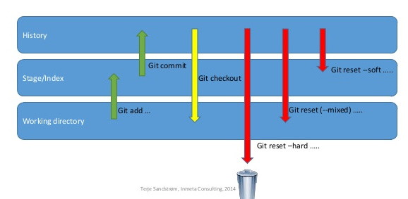

---?color=linear-gradient(180deg, #1E5C97 75%, black 25%)
# Oh shit, **GIT**
@snap[south span-100]
#### Wissenstransfer
Julia Bremer - Univention GMBH
@snapend

---

### **Agenda**

@snap[east span-50]
@img[shadow](assets/img/ohshitgit.png)
@snapend

@snap[west span-50]
@ol[list-spaces-bullets text-05](false)
1. Kleine Einführung
1. Begrifflichkeiten
1. Zeichen
1. Commits
1. Diff und Show
1. Blaming
1. Branches
1. Merge
1. Merge Konflikte
1. Stash
1. Dinge rückgängig machen - reset
1. Dinge rückgängig machen - checkout
1. Dinge rückgängig machen - rebase
1. Dinge rückgängig machen - Aufgaben
1. Reflog
1. Cherry-pick
1. Allgemeine Aufgaben
1. Git submodule
1. Gute Quellen
@olend
@snapend

---

### Kleine **Einführung**
@snap[east span-20]
@img[](assets/img/git.png)
@snapend

@snap[west span-80]
@ul[list-spaced-bullets text-07](false)
- Git wurde 2005 von **Linus Torvalds** initiiert.
- Git bedeutet umgangsprachlich **Blödmann**
- *“I’m an egotistical bastard, and I name all my projects after myself. First ‘Linux’, now ‘Git’.”*
- Unterstützt nicht-lineare Entwicklung sehr, branching und merging ist sehr schnell
@snapend

---
@snap[north-west span-80]
### Begrifflichkeiten
@snapend
@snap[south-west span-80]
@ol[list-spaced-bullets text-05](false)
- **Modified**<div /> Modified bedeutet, dass Änderungen im Working Directory gemacht wurden, die noch nicht gestaged oder committed wurden.
- **Staged**<div /> Staged bedeutet, dass ein File zum commit *vorgemerkt* wurde, aber noch nicht committed wurde
- **Committed**<div /> Committed heißt, dass deine Daten in der Git-Datenbank hinterlegt wurden.
- **origin**<div /> Die URL des remote Repositories von dem geclont wurde.
- **Branch**<div /> Ein Branch ist nur ein Zeiger auf einen Commit und daher ist es sehr schnell ihn zu wechseln
- **HEAD**<div /> Der Commit den man gerade ausgecheckt hat
@olend
@snapend

---
@snap[north-west span-80]
### Zeichen
@snapend
@snap[west span-100]
@ol[list-spaced-bullets text-05](false)
- **^ (caret)** : `<commit>^` referenziert das **Elter** des Commits, `<commit>^2` das zweite Elter (Vorhanden bei merge-commits)
- **~ (tilde)** : `<commit>~`refernziert auch das **Elter** des Commits, ist also äquivalent zu `<commit>^`. `<commit>~x` referenziert jedoch den x-ten **Vorfahren** von `<commit>`.
- **@** : Ein `@`ist das Kürzel für **HEAD**
- **--** : Ein `--` bedeutet, dass die Nachfolgende Referenz ein **File** und keinen Branch/Commit bezeichnet
@olend
@snapend

---
### Commits
@snap[south-west span-100]
@ul[list-spaced-bullets text-07](false)
- Jeder commit besteht aus einem **snapshot** deines Repositories zusammen mit den gemachten Änderungen.
- Jeder commit wird im **.git** Ordner gespeichert und ist **immer** wieder aufrufbar. (Außer du löscht deinen .git Ordner...)
- Jeder commit ist ein Hash aus deinem Repo und seinen Änderungen. Jeder Commithash ist **eindeutig** und führt immer zum gleichen Code.
- Git fügt immer nur Informationen seiner Datenbank hinzu. Gelöscht wird nichts.
- Commits können nicht geändert werden. Bei Änderungen wird immer ein neuer Commit erstellt und der Pointer ausgetauscht.
@ulend
@snapend

---?color=linear-gradient(180deg, #1E5C97 100%, black 0%)
### Diff und Show

```bash zoom-10
git diff
git diff --staged
git diff HEAD
git show <commit>
git diff branch1..branch2
$ git diff branch1...branch2
```
@ul[list-spaced-bullets text-07](false)
- Zeige die **unstaged** Changes
- Zeige die **staged** Changes
- Zeige beides
- Zeige den **`<commit>`**, default ist HEAD
- Zeige den Unterschied zwischen zwei Branches
- Zeige den Unterschied zwischen dem HEAD von Branch2 und dem **"common ancestor"** von branch1 und branch2
@ulend
---?color=linear-gradient(180deg, #1E5C97 100%, black 0%)
### Blaming

@snap[north-south span-100]
@ul[list-spaced-bullets text-07](false)
- Command: **`git blame`**
- Git blame braucht man häufig um herauszufinden, wann und warum eine Änderung gemacht wurde.
- Insgesamt speichert git viele Informationen, bei denen es nützlich ist, diese abzurufen.
@ulend
@snapend

```bash zoom-10
git blame <file>
git blame ^<hash> <file>
git log --diff-filter=A -- <file>
git log --diff-filter=D -- <file>
```
@ul[list-spaced-bullets text-07](false)
- Finde heraus, welcher Commit die letzte Änderung gemacht hat
- Finde heraus, welcher Commit die letzte Änderung vor Commit `<hash>` gemacht hat
- Finde heraus, durch welchen Commit `<file>` dem Repo hinzugefügt wurde
- Dementsprechend: Wer hat das `<file>` gelöscht?
@ulend

---?color=linear-gradient(180deg, #1E5C97 100%, black 0%)
### Branches
@snap[north-south span-100]
@ul[list-spaced-bullets text-07](false)
- Ein Branch ist ein **Pointer** auf einen commit
- Dabei ist der **HEAD** des neuen Branches <br />zunächst der selbe,wie der des Branches <br />auf dem du den Befehl ausgeführt hast
@ulend
@snapend
@snap[east span-20]
@img[](assets/img/workflow.png)
@snapend

@snap[span-80]
```bash zoom-10
git branch
git branch <branchname>
git checkout -b <branchname>
git branch -D <branchname>
git push --delete origin <branchname>
```
@snapend
@ul[list-spaced-bullets text-07](false)
- Finde heraus auf welchem Branch du bist
- Kreiere einen neuen Branch auf Basis des aktuellen Branches
- Kreiere einen neuen Branch und checke ihn gleich aus
- Lösche einen Branch lokal
- Lösche einen Branch remote
@ulend
---?color=linear-gradient(180deg, #1E5C97 100%, black 0%)

### Merge
@snap[west-south span-100]
@ol[list-spaced-bullets text-06](false)
- Um Branches zusammenzubringen
- Fast-forward : Der Pointer des Commits wird einfach nach vorne geschoben
- Merge made by the *'recursive'* strategy. (Three-way-merge)
- Wenn kein fast-forward möglich ist, dann wird ein neuer commit (merge commit) erstellt, der zwei Elter hat
- `git pull` ist ein Update der remote Referenzen + merge
- `git merge --abort` Bricht einen merge ab
@snapend
@olend

---?color=linear-gradient(180deg, #1E5C97 100%, black 0%)

### Merge-Konflikte
@snap[west-south span-100]
@ol[list-spaced-bullets text-07](false)
- Wenn in zwei Branches ein File unterschiedlich geändert wurde, tritt ein *merge Konflikt* auf.
- In diesem Fall lässt sich mit **git status** anzeigen in welchen Files der Konflikt liegt.
- Um den Konflikt zu beheben muss man die Markierungen, die Git in dieses File eingefügt hat entfernen und **`git add <file>`** und **`git commit`** ausführen
@olend
@snapend

@snap[span-100]
```bash zoom-07
$ git status
On branch master
You have unmerged paths.
(fix conflicts and run "git commit")
Unmerged paths:
(use "git add <file>..." to mark resolution)
both modified:
index.html
```
@snapend
---?color=linear-gradient(180deg, #1E5C97 100%, black 0%)


### Merge-Konflikte

@ol[text-07](false)
- So ein File sieht dann in etwa so aus:
@olend
@snap[span-100]
```bash zoom-09
<<<<<<< HEAD:index.html
<div id="footer">contact : email.support@github.com</div>
=======
<div id="footer"> please contact us at support@github.com</div>
>>>>>>>
iss53:index.html
```
@snapend

@ol[text-07](false)
- Eine Mögliche Lösung wäre:
@olend

@snap[span-100]
```bash zoom-09
<div id="footer">
please contact us at email.support@github.com
</div>
```
@snapend
---?color=linear-gradient(180deg, #1E5C97 100%, black 0%)
### Stash

@snap[west-south span-100]
@ol[list-spaced-bullets text-07](false)
- Bevor man Dinge rückgängig macht noch ein paar Infos. Es gibt einige gefährliche Kommandos, die **uncommittete Änderungen verwerfen**.
- Wenn man diese benutzen will, sollte man noch mal *git commit* oder git *stash* ausführen.
- *git stash* macht einen Snapshot von allen Änderungen im Repo und im Index ohne dass ein *git add* nötig wäre. Danach setzt der Befehl das Working Directory wieder auf HEAD zurück.
- mit *git stash list* lassen sich alle gestashten Snapshots anzeigen
- mit *git stash apply* kann man diese nach einem Reset wieder anwenden
@olend
@snapend

---?color=linear-gradient(180deg, #1E5C97 100%, black 0%)
#### Dinge rückgängig machen - reset

@snap[span-100]
```bash zoom-09
git reset --soft HEAD
git reset HEAD
git reset --hard HEAD (!)
git reset --hard origin/<branchname> (!)
```
@snapend

@ol[list-spaced-bullets text-07](false)
- Git reset gibt es in drei Modi. *soft*, *mixed* und *hard*
- Soft tut committete Änderungen in die staging Area
- Mixed, der default tut committete Änderungen auf unstaged
- Hard löscht uncommittete die Änderungen
- Diesen Befehl brauche ich häufig wenn jemand anders geforce-pushed hat.
@olend

---?color=linear-gradient(180deg, #1E5C97 100%, black 0%)

---?color=linear-gradient(180deg, #1E5C97 100%, black 0%)
#### Dinge rückgängig machen - weiteres
@snap[span-100]
```bash zoom-09
git checkout <commit> (!)
git checkout <commit> -- <filename> (!)
git revert <commit>
git clean -fdx <path> (!)
```
@snapend
@ol[list-spaced-bullets text-07](false)
- Ändert den HEAD, sodass er auf den Commit zeigt. Wie das bekannte git checkout `<branch>`
- Checked das File in `<commit>`aus. Deine Änderungen werden verworfen.
- Erstellt einen **`revert commit`**, der genau das Gegenteil von **`<commit`** tut
- Löscht **unversionierte** files im Repository.  -x keine Ignorerules benutzen, -f force, -d directories
@olend
---?color=linear-gradient(180deg, #1E5C97 100%, black 0%)
#### Dinge rückgängig machen - rebase

@snapend
@snap[north-south span-100]
@ol[list-spaced-bullets text-07](false)
- Mithilfe von git commit --amend kann man einen neuen Commit erstellen, der an die Stelle des alten gestellt wird.
- Mithilfe von **git rebase -i** kann man in die Vergangenheit reisen um einen früheren commit als HEAD zu ammenden.
@olend
@snapend
@snap[span-100]
```bash zoom-09
git commit --amend
git rebase -i @~x
# Commands:
# p, pick = use commit
# r, reword = use commit, but edit the commit message
# e, edit = use commit, but stop for amending
# s, squash = use commit, but meld into previous commit
# f, fixup = like "squash", but discard this commit's log message
# x, exec = run command (the rest of the line) using shell
# d, drop = remove commit

```
@snapend

@ol[list-spaced-bullets text-07](false)
- Wie ein kleiner Rebase. Wenn **git add** und **git commit --amend** ausgeführt werden, wird ein neuer Commit erstellt und an Stelle des alten gesetzt.
- Wenn man frühere commits als HEAD abändern will.
@olend

---?image=assets/img/code.jpg&opacity=60&position=left&size=45% 100%
#### Git reflog
@snap[west-south span-100]
@ol[list-spaced-bullets text-07](false)
- Kommando: git reflog
- Mit **git reflog** lassen sich alle Commits referenzieren, die in eurem lokalen Repo bisher gemacht wurden.
- Ihr könnt also mithilfe von **checkout** alle bisher gemachten Änderungen, auch die bei der ihr die Historie verändert habt, wieder rückgängig machen.
- Um den jetzigen Head auf den alten Commit zu resetten: git reset `<commit>`
- Um den HEAD des Branches auf einen anderen commit zu setzen: **`git branch -f <branchname> <commit>`**
@olend
@snapend

---?image=assets/img/code.jpg&opacity=60&position=left&size=45% 100%

#### Cherry-pick
@snap[west-south span-100]
@ol[list-spaced-bullets text-07](false)
- **`git cherry-pick`** : Damit kann man commits aus anderen Branches auf den eigenen anwenden.
- **`git cherry-pick ^A..B`** : Mehrere Commits cherry-picken A-B inklusive A (daher das **^**).
@olend
@snapend

---?image=assets/img/code.jpg&opacity=60&position=left&size=45% 100%
#### Git submodule
@snap[west-south span-100]
@ol[list-spaced-bullets text-07](false)
- Manchmal haben git repos git repos
- Ob es welche gibt sieht man an **git submodule status**
- An diese kommt man mit **git submodule init --recursive**
- Beispiel: **ucs-ec2-tools**
- Löschen kann man diese wieder mit **git submodule deinit**
@olend
@snapend
---?image=assets/img/code.jpg&opacity=60&position=left&size=45% 100%
#### Gute Quellen

@snap[west-south span-100]
@ol[list-spaced-bullets text-07]
- **man git** und **man git `command`** (natürlich)
- progit https://git-scm.com/book/de/v2
- **oh shit, git** https://ohshitgit.com/
@olend
@snapend
---?image=assets/img/code.jpg&opacity=60&position=left&size=45% 100%
## **Danke** für eure Aufmerksamkeit
